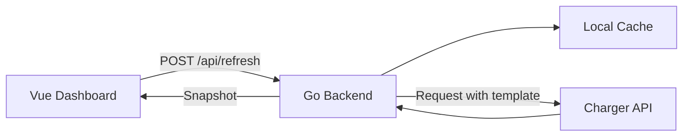

# Charge API Dashboard


一个用于查看充电桩端口占用情况的本地看板。后端使用 Go 请求充电桩接口，前端使用 Vue + TypeScript 展示多个充电桩、多个充电口的实时状态、已用时间和剩余时间。

## 功能亮点

- 多桩管理：支持动态添加、删除充电桩。
- 端口看板：展示每个充电口的空闲、使用中、离线状态。
- 时间信息：显示使用中端口的已用时间和剩余时间。
- 主动刷新：由用户点击按钮后请求远端接口，不做自动高频轮询。
- 刷新保护：短时间重复刷新会优先返回本地缓存。
- 状态持久化：重启后恢复已添加设备、最新快照、刷新时间和 Cookie。
- Cookie 更新：登录态失效后可在页面粘贴新 Cookie 并立即验证。

## 技术栈

| Layer | Stack |
| --- | --- |
| Backend | Go, net/http |
| Frontend | Vue 3, TypeScript, Vite, Pinia, Naive UI |
| Cache | Local JSON file |
| Data Source | Remote charger API request template |

## 工作流程



## 项目结构

```text
backend/
  cmd/server/              # 后端入口
  internal/api/            # HTTP API
  internal/charger/        # 远端接口客户端
  internal/parser/         # 抓包模板解析
  internal/persistence/    # 本地状态缓存
  internal/store/          # 看板状态管理

frontend/
  src/
    components/            # 看板组件
    stores/                # Pinia 状态
    types/                 # TypeScript 类型

examples/capture-template/ # 脱敏请求模板
```

## 快速开始

### 1. 准备请求模板

```bash
cp -R examples/capture-template 20260601_202646
```

编辑模板目录里的文件，填入你自己的远端接口 URL、请求体和请求头：

```text
20260601_202646/0/basic
20260601_202646/0/request_body
20260601_202646/0/request_headers
```

如需预加载多个充电桩，可以继续添加 `1/`、`2/` 等同结构目录。

### 2. 启动后端

```bash
cd backend
go build -o server ./cmd/server
./server -listen :8080 -capture ../20260601_202646 -state ../charge_state.json
```

### 3. 启动前端

```bash
cd frontend
npm install
npm run dev
```

默认访问地址：

```text
http://localhost:5173
```

## API

| Method | Path | Description |
| --- | --- | --- |
| GET | `/healthz` | 健康检查 |
| GET | `/api/piles` | 获取看板快照 |
| POST | `/api/piles` | 添加充电桩 |
| DELETE | `/api/piles/:id` | 删除充电桩 |
| POST | `/api/refresh` | 主动刷新远端状态 |
| POST | `/api/session/cookie` | 更新并验证 Cookie |
| GET | `/api/stream` | SSE 快照推送 |

## 本地缓存

运行状态会保存到：

```text
charge_state.json
```

服务启动时会先读取本地缓存，不会自动请求远端接口。这样在开发、重启和部署调试时，可以减少不必要的远端访问。

## 说明

本项目适用于个人或内部设备监控。请只访问你有权限查看的设备，并遵守远端服务的使用规则，避免高频请求。
