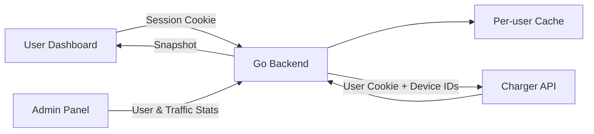

# Charge API Dashboard


一个用于查看充电桩端口占用情况的多用户看板。后端使用 Go 请求充电桩接口，前端使用 Vue + TypeScript 展示多个充电桩、多个充电口的实时状态、已用时间和剩余时间。

## 功能亮点

- 多桩管理：支持动态添加、删除充电桩。
- 用户隔离：每个用户使用自己的 Cookie、设备列表和本地缓存。
- 自助注册：普通用户可以自行注册并维护自己的充电桩。
- 管理后台：管理员只查看流量监控大屏，并可以添加、禁用、删除用户。
- 流量统计：按用户统计访问次数、刷新次数、远端请求次数和失败次数。
- 登录防护：Argon2id 密码哈希、Cloudflare Turnstile、人机验证失败锁定和 IP 限流。
- 端口看板：展示每个充电口的空闲、使用中、离线状态。
- 时间信息：显示使用中端口的已用时间和剩余时间。
- 主动刷新：由用户点击按钮后请求远端接口，不做自动高频轮询。
- 刷新保护：短时间重复刷新会优先返回本地缓存。
- 状态持久化：重启后恢复已添加设备、最新快照、刷新时间和 Cookie。
- Cookie 更新：登录态失效后可在页面粘贴新 Cookie 并立即验证。

## 技术栈

| Layer | Stack |
| --- | --- |
| Backend | Go, net/http |
| Frontend | Vue 3, TypeScript, Vite, Pinia, Naive UI |
| Cache | Local JSON file |
| Data Source | Remote charger API request template |

## 工作流程



## 项目结构

```text
backend/
  cmd/server/              # 后端入口
  internal/api/            # HTTP API
  internal/charger/        # 远端接口客户端
  internal/parser/         # 抓包模板解析
  internal/persistence/    # 本地状态缓存
  internal/store/          # 看板状态管理

frontend/
  src/
    components/            # 看板组件
    stores/                # Pinia 状态
    types/                 # TypeScript 类型

examples/capture-template/ # 脱敏请求模板
```

## 快速开始

### 1. 安装依赖

```bash
make setup
```

只需首次安装或依赖变化后执行。

### 2. 一键启动本地环境

```bash
make dev
```

该命令会同时启动 Go 后端和 Vite 前端，并自动使用 Cloudflare Turnstile 官方测试密钥：

```text
前端地址：http://127.0.0.1:5173
管理员账号：admin
管理员密码：localadmin123
本地状态：.local/charge_state.json
```

按 `Ctrl+C` 会同时停止前后端。`.local/charge_state.json` 会保留，所以下次启动仍能读取上次的用户和设备状态。

如需自定义：

```bash
LOCAL_ADMIN_PASSWORD="your-local-password" make dev
BACKEND_PORT=18080 FRONTEND_PORT=5174 make dev
LOCAL_STATE_FILE=/private/tmp/charge-test.json make dev
```

管理员密码只在首次创建该状态文件时生效。已有状态文件不会因为修改环境变量而重置密码。

如果想清空本地测试用户、Cookie 和设备状态：

```bash
make reset-local
```

命令会先要求确认，不影响服务器上的状态文件。

### 3. 一键验证

```bash
make check
```

它会依次执行：

- Go 单元测试
- Go 后端构建
- Vue TypeScript 检查
- 前端生产构建

后端已经内置默认充电桩请求模板，不需要额外准备抓包目录。

## API

| Method | Path | Description |
| --- | --- | --- |
| GET | `/healthz` | 健康检查 |
| GET | `/api/auth/config` | 获取公开的人机验证配置 |
| POST | `/api/auth/login` | 登录 |
| POST | `/api/auth/register` | 普通用户注册 |
| POST | `/api/auth/logout` | 退出 |
| GET | `/api/auth/me` | 当前用户 |
| GET | `/api/piles` | 获取看板快照 |
| POST | `/api/piles` | 添加充电桩 |
| DELETE | `/api/piles/:id` | 删除充电桩 |
| POST | `/api/refresh` | 主动刷新远端状态 |
| POST | `/api/session/cookie` | 更新并验证 Cookie |
| GET | `/api/admin/users` | 管理员用户列表和统计 |
| POST | `/api/admin/users` | 管理员添加用户 |
| PATCH | `/api/admin/users/:id` | 管理员更新用户 |
| DELETE | `/api/admin/users/:id` | 管理员删除用户 |
| GET | `/api/stream` | SSE 快照推送 |

## 本地缓存

运行状态会保存到：

```text
charge_state.json
```

服务启动时会先读取本地缓存，不会自动请求远端接口。用户、Cookie、设备列表、看板快照和流量统计都会按用户独立保存。

## 登录安全

- 新密码使用 Argon2id 保存。
- 旧版 SHA-256 密码在下一次成功登录时自动升级，无需用户重置。
- 登录和注册必须通过 Cloudflare Turnstile 服务端验证。
- 同一 IP 5 分钟最多提交 20 次登录或注册请求。
- 同一账号或 IP 连续失败 5 次后锁定 15 分钟。
- 验证码失败只锁定 IP，不会被用于恶意锁定其他人的账号。

生产环境建议在 Cloudflare Turnstile 创建 Managed Widget，并将域名加入允许列表。服务器环境文件示例：

```text
CHARGE_ADMIN_PASSWORD=your-admin-password
TURNSTILE_REQUIRED=true
TURNSTILE_SITE_KEY=your-site-key
TURNSTILE_SECRET_KEY=your-secret-key
TURNSTILE_HOSTNAME=charge.example.com
```

本地测试可以使用 Cloudflare 官方测试密钥：

```text
TURNSTILE_SITE_KEY=1x00000000000000000000AA
TURNSTILE_SECRET_KEY=1x0000000000000000000000000000000AA
```

## 说明

本项目适用于个人或内部设备监控。请只访问你有权限查看的设备，并遵守远端服务的使用规则，避免高频请求。
