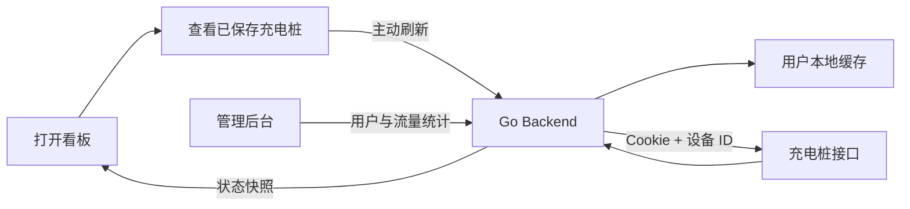

# Charge Console


一个用于查看充电桩使用情况的轻量看板。它把常看的充电桩和充电口集中到一个页面里，方便快速判断哪里空闲、哪里正在使用、哪里离线，不用每次都找到服务号、扫码、再进入对应页面查看。

这个项目适合个人或小范围内部使用。每个用户维护自己的充电桩列表和访问凭据，系统只在用户主动刷新时请求远端接口，并会在短时间重复刷新时优先返回缓存，尽量减少不必要的远端访问。

## 功能亮点

- 免重复扫码：把常用充电桩固定在看板里，日常查看不必反复从服务号扫码进入。
- 端口状态一眼可见：展示每个充电口的空闲、使用中、离线状态。
- 使用时间参考：显示使用中端口的已用时间和剩余时间，方便判断是否值得等待。
- 多桩管理：支持添加、删除多个充电桩，并按名称、地址或端口状态筛选。
- 用户隔离：每个用户使用自己的设备列表、Cookie 和本地缓存。
- 主动刷新：由用户点击按钮后请求远端接口，不做自动高频轮询。
- 刷新保护：短时间重复刷新会优先返回本地缓存，降低远端请求频率。
- 状态持久化：重启后恢复已添加设备、最新快照、刷新时间和 Cookie。
- 手动更新凭据：Cookie 失效时可在页面粘贴新的 Cookie 并立即验证；系统不会自动获取或续期 Cookie。
- 自助注册：普通用户可以自行注册并维护自己的充电桩。
- 管理后台：管理员只查看流量监控大屏，并可以添加、禁用、删除用户。
- 流量统计：按用户统计访问次数、刷新次数、远端请求次数和失败次数。
- 登录防护：Argon2id 密码哈希、Cloudflare Turnstile、人机验证失败锁定和 IP 限流。

## 技术栈

| Layer | Stack |
| --- | --- |
| Backend | Go, net/http |
| Frontend | Vue 3, TypeScript, Vite, Pinia, shadcn-style components |
| Storage | SQLite |
| Data Source | Remote charger API request template |

## 工作流程



## 项目结构

```text
backend/
  cmd/server/              # 后端入口
  internal/api/            # HTTP API
  internal/charger/        # 远端接口客户端
  internal/parser/         # 抓包模板解析
  internal/persistence/    # 本地状态缓存
  internal/store/          # 看板状态管理

frontend/
  src/
    components/            # 看板组件
    stores/                # Pinia 状态
    types/                 # TypeScript 类型

examples/capture-template/ # 脱敏请求模板
```

## 快速开始

### 1. 安装依赖

```bash
make setup
```

只需首次安装或依赖变化后执行。

### 2. 一键启动本地环境

```bash
make dev
```

该命令会同时启动 Go 后端和 Vite 前端，并自动使用 Cloudflare Turnstile 官方测试密钥：

```text
前端地址：http://127.0.0.1:5173
管理员账号：admin
管理员密码：localadmin123
本地数据库：.local/charge_state.db
```

按 `Ctrl+C` 会同时停止前后端。SQLite 数据库和本地 Cookie 加密密钥会保存在 `.local/`，下次启动会继续读取原有状态。

如需自定义：

```bash
LOCAL_ADMIN_PASSWORD="your-local-password" make dev
BACKEND_PORT=18080 FRONTEND_PORT=5174 make dev
LOCAL_DATABASE_FILE=/private/tmp/charge-test.db make dev
```

如需在本地同时连接 yyb_go sidecar，先启动 yyb_go：

```bash
yyb-go -host 127.0.0.1 -port 8000 -resource-root /opt/yyb_go/resource
```

然后把 sidecar 地址和共享密钥透传给 Charge。可以临时写在命令前：

```bash
YYB_BASE_URL=http://127.0.0.1:8000 YYB_API_SECRET=your-local-hmac-secret make dev
```

更推荐放进本地配置文件，避免每次重复输入：

```bash
mkdir -p .local
cp examples/dev.env.example .local/dev.env
```

编辑 `.local/dev.env`：

```text
YYB_BASE_URL=http://127.0.0.1:8000
YYB_API_SECRET=your-local-hmac-secret
```

之后直接运行：

```bash
make dev
```

`.local/dev.env` 已被 `.gitignore` 排除，不会提交到 GitHub。若同名环境变量已经在当前 shell 中设置，shell 里的值优先生效。

`yyb_go` 只应监听 `127.0.0.1:8000`，不要公网暴露。

管理员密码只在首次创建数据库时生效。已有数据库不会因为修改环境变量而重置密码。

如果想清空本地测试用户、Cookie 和设备状态：

```bash
make reset-local
```

命令会先要求确认，不影响服务器上的数据库。

### 3. 一键验证

```bash
make check
```

它会依次执行：

- 部署脚本检查
- Go 单元测试
- Go 后端构建
- 前端测试
- Vue TypeScript 检查和生产构建

后端已经内置默认充电桩请求模板，不需要额外准备抓包目录。

## 部署同步

服务器初次配置完成后，推荐通过 GitHub 同步代码、远端构建并重启服务：

```bash
make deploy-git DEPLOY_HOST=root@8.148.25.204
```

`deploy-git` 会先确认本地没有未提交改动，然后执行：

```bash
git push origin main
ssh root@8.148.25.204
cd /opt/charge-api
git pull --ff-only origin main
```

之后在服务器构建前端、构建后端、重启 systemd 服务并检查 `/healthz`。

默认远端目录是 `/opt/charge-api`，默认分支是当前本地分支，默认 systemd 服务名是 `charge-api`。如果你的服务器配置不同，可以这样覆盖：

```bash
make deploy-git \
  DEPLOY_HOST=root@8.148.25.204 \
  DEPLOY_PATH=/opt/charge-api \
  DEPLOY_BRANCH=main \
  SERVICE_NAME=charge-api
```

如果只是改了文案或已经本地验证过，可以临时跳过本地检查：

```bash
SKIP_CHECK=1 make deploy-git DEPLOY_HOST=root@8.148.25.204
```

第一次使用前可以先预演，不会推送 GitHub，也不会连接服务器：

```bash
SKIP_CHECK=1 make deploy-git DEPLOY_HOST=root@8.148.25.204 DEPLOY_ARGS=--dry-run
```

服务器端会执行：

```bash
git pull --ff-only origin main
cd frontend && npm ci && npm run build
cd ../backend && go build -o charge-server ./cmd/server
sudo systemctl restart charge-api
curl http://127.0.0.1:8080/healthz
```

服务器上的 `/var/lib/charge-api/charge_state.db` 和 `/etc/charge-api.env` 不在 Git 仓库里，会继续由服务器自己维护。

如果 GitHub 临时不可用，也可以使用备用的本地直传方式：

```bash
make deploy DEPLOY_HOST=root@8.148.25.204
```

备用脚本通过 `rsync` 同步本地文件，会排除本地数据库、Cookie 密钥、`.local/`、`.env`、`node_modules/`、`frontend/dist/` 等运行文件。

## API

| Method | Path | Description |
| --- | --- | --- |
| GET | `/healthz` | 健康检查 |
| GET | `/api/auth/config` | 获取公开的人机验证配置 |
| POST | `/api/auth/login` | 登录 |
| POST | `/api/auth/register` | 普通用户注册 |
| POST | `/api/auth/logout` | 退出 |
| GET | `/api/auth/me` | 当前用户 |
| GET | `/api/piles` | 获取看板快照 |
| POST | `/api/piles` | 添加充电桩 |
| DELETE | `/api/piles/:id` | 删除充电桩 |
| POST | `/api/refresh` | 主动刷新远端状态 |
| POST | `/api/session/cookie` | 更新并验证 Cookie |
| GET | `/api/admin/users` | 管理员用户列表和统计 |
| POST | `/api/admin/users` | 管理员添加用户 |
| PATCH | `/api/admin/users/:id` | 管理员更新用户 |
| DELETE | `/api/admin/users/:id` | 管理员删除用户 |
| GET | `/api/stream` | SSE 快照推送 |

## 数据存储

运行状态会保存到 SQLite：

```text
charge_state.db
```

用户、设备列表、看板快照和流量统计会按用户独立保存。Cookie 使用 AES-256-GCM 加密后写入数据库，密钥通过 `CHARGE_COOKIE_KEY` 提供。

### 生产密钥

当前线上服务已经通过 Cloudflare 访问，不需要重新配置备案或从零部署。服务器只需要在环境文件中长期保存运行密钥。

需要准备三类密钥：

| 环境变量 | 用途 | 生成命令 |
| --- | --- | --- |
| `CHARGE_COOKIE_KEY` | Charge SQLite 中用户 Cookie 与敏感状态的 AES-GCM 加密密钥 | `openssl rand -base64 32` |
| `YYB_SECRET_KEY` | yyb_go SQLite 中 `login_buffer`、OAuth credentials、session blob 的 AES-GCM 加密密钥 | `openssl rand -base64 32` |
| `YYB_API_SECRET` | Charge 调用 yyb_go sidecar 时使用的 HMAC 共享密钥 | `openssl rand -base64 48` |

也可以在本地生成一组示例值：

```bash
./scripts/gen_secrets.sh
```

将输出保存到服务器环境变量中。密钥必须保持不变，否则已有加密数据无法解密：

```text
CHARGE_COOKIE_KEY=base64-encoded-32-byte-key
YYB_SECRET_KEY=base64-encoded-32-byte-key
YYB_API_SECRET=base64-encoded-hmac-secret
```

服务器环境文件必须只允许服务用户读取，例如：

```bash
sudo chown root:charge /etc/charge-api.env
sudo chmod 0600 /etc/charge-api.env
```

如果 yyb_go 使用独立环境文件，也应使用同样的 `0600` 权限。


## 生产运维加固

当前线上入口仍由 Cloudflare 访问 Charge；反向代理只暴露 Charge 的 `8080` 上游，`yyb_go` 只作为本机 sidecar 监听 `127.0.0.1:8000`，不对公网开放。

### systemd 模板

仓库提供两份可参考模板：

```text
deploy/systemd/charge.service
deploy/systemd/yyb-go.service
```

复制到服务器前先按实际用户名、安装路径和环境文件路径确认一遍：

```bash
sudo cp deploy/systemd/charge.service /etc/systemd/system/charge-api.service
sudo cp deploy/systemd/yyb-go.service /etc/systemd/system/yyb-go.service
sudo systemctl daemon-reload
```

两份模板都包含以下隔离配置：

```ini
NoNewPrivileges=true
PrivateTmp=true
ProtectSystem=strict
ProtectHome=true
UMask=0077
```

Charge 只允许写入 `/var/lib/charge-api`；yyb_go 只允许写入 `/opt/yyb_go/resource`。

### 生产启动命令

Charge 后端应只监听本机地址，由 Cloudflare/Nginx/Caddy 等入口反向代理到它：

```bash
/opt/charge-api/backend/charge-server -listen 127.0.0.1:8080 -database /var/lib/charge-api/charge_state.db -state /var/lib/charge-api/charge_state.json
```

yyb_go sidecar 必须只监听本机回环地址：

```bash
/opt/yyb_go/yyb-go -host 127.0.0.1 -port 8000 -resource-root /opt/yyb_go/resource -db yyb.db
```

Charge 环境文件需要包含：

```text
CHARGE_COOKIE_KEY=base64-encoded-32-byte-key
YYB_API_SECRET=base64-encoded-hmac-secret
YYB_BASE_URL=http://127.0.0.1:8000
```

yyb_go 环境文件需要包含：

```text
YYB_SECRET_KEY=base64-encoded-32-byte-key
YYB_API_SECRET=base64-encoded-hmac-secret
```

其中 `YYB_API_SECRET` 两边必须一致。

### 监听和防火墙检查

确认 `yyb_go` 只绑定到 `127.0.0.1:8000`：

```bash
ss -lntp | grep ':8000'
```

预期只能看到类似：

```text
LISTEN 0 4096 127.0.0.1:8000 0.0.0.0:* users:(("yyb-go",pid=1234,fd=7))
```

不应出现 `0.0.0.0:8000` 或公网 IP。防火墙也应拒绝入站 `8000/tcp`：

```bash
sudo ufw deny 8000/tcp
sudo ufw status
```

### 权限检查

环境文件和 SQLite 数据库应只允许服务用户读取：

```bash
stat -c '%a %n' /etc/charge-api.env /etc/yyb-go.env /var/lib/charge-api/charge_state.db /opt/yyb_go/resource/db/yyb.db
```

推荐结果：

```text
600 /etc/charge-api.env
600 /etc/yyb-go.env
600 /var/lib/charge-api/charge_state.db
600 /opt/yyb_go/resource/db/yyb.db
```

如果权限过宽，可收紧为：

```bash
sudo chmod 0600 /etc/charge-api.env /etc/yyb-go.env
sudo chmod 0600 /var/lib/charge-api/charge_state.db /opt/yyb_go/resource/db/yyb.db
```

### 备份策略

两个 SQLite 文件都包含加密后的敏感状态，备份时仍应按敏感数据处理：

```text
/var/lib/charge-api/charge_state.db
/opt/yyb_go/resource/db/yyb.db
```

备份要求：

- 只做加密备份，或从日常明文备份中排除。
- 同时离线保存 `CHARGE_COOKIE_KEY`、`YYB_SECRET_KEY`、`YYB_API_SECRET`。
- 不要在服务运行时只复制 `.db` 主文件；如果启用 WAL，应先停服务或使用 SQLite 在线备份工具。
- 恢复演练时必须使用原始密钥，否则数据库中的 Cookie 和 yyb_go 凭据无法解密。


### 端到端安全检查

部署完成后可以在服务器上运行安全检查脚本，确认 yyb_go 未暴露到公网、未签名请求被拒绝、数据库和日志没有出现已知明文敏感值：

```bash
./scripts/security_check.sh
```

首次运行前可以预演，不会连接服务、读取数据库或访问 journal：

```bash
./scripts/security_check.sh --dry-run
```

默认检查当前推荐路径：

```text
Charge:  http://127.0.0.1:8080
Yyb_go:  http://127.0.0.1:8000
Charge DB: /var/lib/charge-api/charge_state.db
yyb_go DB: /opt/yyb_go/resource/db/yyb.db
Units: charge-api yyb-go
```

如果服务器路径不同，可通过环境变量覆盖：

```bash
CHARGE_DB_FILE=/path/to/charge_state.db YYB_DB_FILE=/path/to/yyb.db LOG_UNITS="charge-api yyb-go" ./scripts/security_check.sh
```

如果后续新增了能触发 Charge 调用 yyb_go 的业务端点，可以把它加入同一检查：

```bash
CHARGE_SIGNED_FLOW_URL=http://127.0.0.1:8080/api/session/yyb-binding CHARGE_SESSION_COOKIE='charge_session=...' ./scripts/security_check.sh
```

## 登录安全

- 密码使用 Argon2id 哈希保存。
- 登录和注册必须通过 Cloudflare Turnstile 服务端验证。
- 同一 IP 5 分钟最多提交 20 次登录或注册请求。
- 同一账号或 IP 连续失败 5 次后锁定 15 分钟。
- 验证码失败只锁定 IP，不会被用于恶意锁定其他人的账号。
- Session 默认有效期为 7 天，每个用户最多保留 5 个登录会话。
- Session 持久化到 SQLite，服务重启后登录状态仍然有效。
- 修改密码、角色、禁用或删除用户时，该用户的全部 Session 会立即失效。
- 管理员只能访问用户管理与流量统计接口，不能访问普通用户的充电桩接口。
- `/api/` 默认按 IP 限制为每分钟 300 次请求，超限返回 `429`。
- JSON 接口启用请求体大小限制、未知字段检查和单对象检查。

生产环境默认只允许同源请求。只有前后端使用不同域名时，才需要配置跨域白名单，多个来源使用逗号分隔：

```text
CORS_ALLOWED_ORIGINS=https://console.example.com,https://admin.example.com
```

不要使用 `*`。Nginx反向代理需要保留：

```nginx
proxy_set_header Host $host;
proxy_set_header X-Real-IP $remote_addr;
proxy_set_header X-Forwarded-For $proxy_add_x_forwarded_for;
proxy_set_header X-Forwarded-Proto $scheme;
```

生产环境建议在 Cloudflare Turnstile 创建 Managed Widget，并将域名加入允许列表。服务器环境文件示例：

```text
CHARGE_ADMIN_PASSWORD=your-admin-password
CHARGE_COOKIE_KEY=base64-encoded-32-byte-key
YYB_SECRET_KEY=base64-encoded-32-byte-key
YYB_API_SECRET=base64-encoded-hmac-secret
TURNSTILE_REQUIRED=true
TURNSTILE_SITE_KEY=your-site-key
TURNSTILE_SECRET_KEY=your-secret-key
TURNSTILE_HOSTNAME=charge.example.com
# 仅当前后端跨域部署时填写
CORS_ALLOWED_ORIGINS=https://console.example.com
```

本地测试可以使用 Cloudflare 官方测试密钥：

```text
TURNSTILE_SITE_KEY=1x00000000000000000000AA
TURNSTILE_SECRET_KEY=1x0000000000000000000000000000000AA
```

## 说明

本项目适用于个人或内部设备监控。请只访问你有权限查看的设备，并遵守远端服务的使用规则，避免高频请求。
