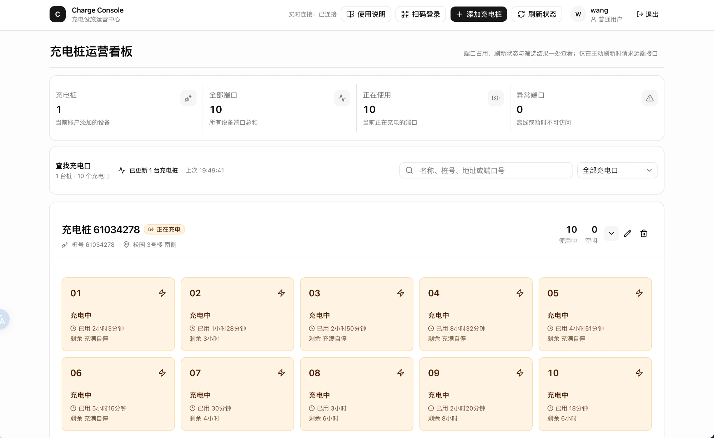
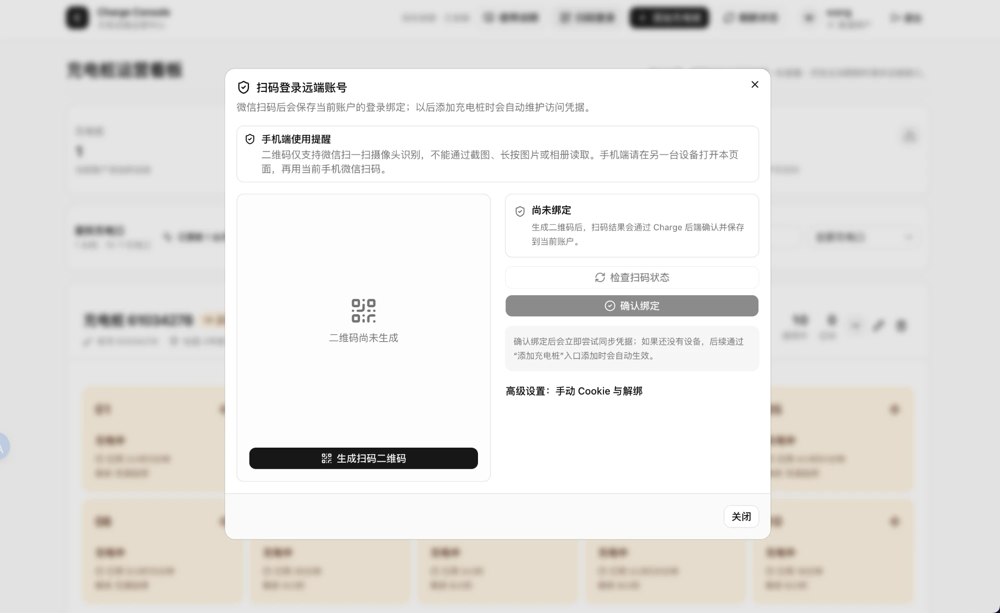
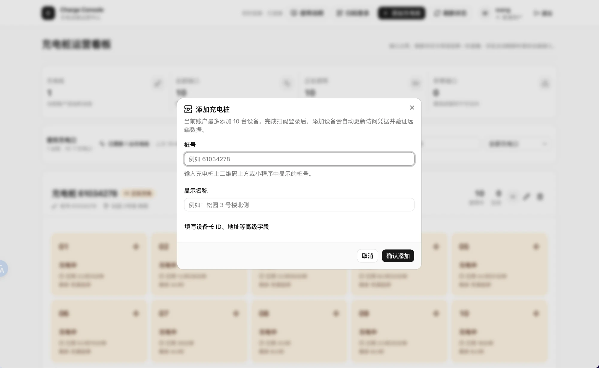
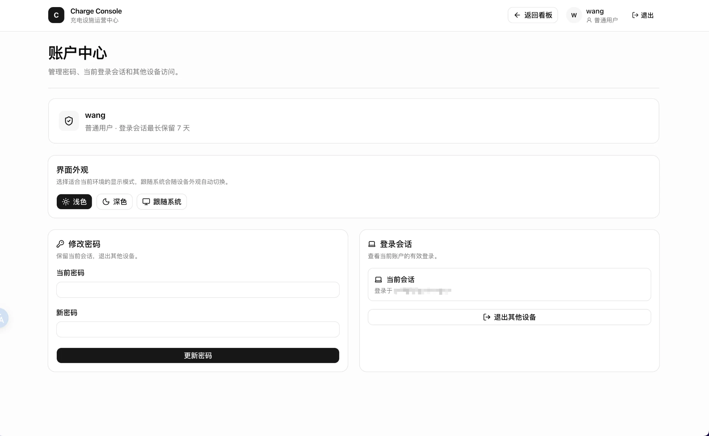
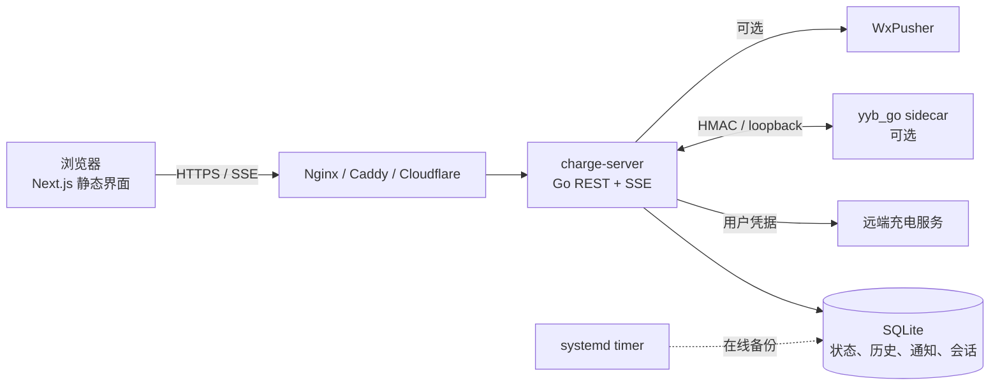

<h1 align="center">Charge Console</h1>

<p align="center">
  轻量、自托管的充电桩状态看板，把常用充电桩、历史趋势和空闲提醒集中到一个页面。
</p>

<p align="center">
  <a href="https://github.com/ninuan/charge-api/actions/workflows/ci.yml"></a>
  <a href="https://github.com/ninuan/charge-api/releases"></a>
  
  
  
  <a href="LICENSE"></a>
</p>

<p align="center">
  <a href="#快速开始">快速开始</a> ·
  <a href="#功能概览">功能概览</a> ·
  <a href="docs/deployment.md">生产部署</a> ·
  <a href="docs/openapi/charge-console-v1.5.2.yaml">OpenAPI</a> ·
  <a href="CHANGELOG.md">更新日志</a>
</p>



Charge Console 适合个人或小范围内部使用。它将常看的充电桩固定在一个响应式看板中，让用户不必每次从服务号重新扫码进入；每个账户独立保存设备、访问凭据、快照、提醒和通知。系统只在用户主动刷新或明确开启提醒时访问远端，并通过缓存、同桩请求合并、额度和退避策略控制请求频率。

> [!IMPORTANT]
> 请仅接入你有权访问的设备，并遵守远端服务的使用规则。Charge Console 不是充电平台的官方客户端，也不应被用于高频采集。

## 功能概览

| 能力         | 说明                                                                             |
| ------------ | -------------------------------------------------------------------------------- |
| 实时看板     | 集中展示多台充电桩及端口的空闲、使用中和离线状态，支持筛选与手动刷新。           |
| 使用与历史   | 展示已用时间、剩余时间，以及设备和单端口最近 24 小时、7 天、30 天的状态趋势。    |
| 空闲提醒     | 可开启 1、2、4 小时或持续到计划断电前的临时提醒；发现空闲后通知一次并自动结束。  |
| 多通道通知   | 内置站内通知和浏览器提醒；可选 WxPusher 微信提醒、扫码绑定、消息偏好和投递状态。 |
| 凭据管理     | 支持手动更新 Cookie；接入 `yyb_go` 后可扫码绑定账号，并在凭据失效时尝试恢复。    |
| 多用户与管理 | 用户数据相互隔离；管理员可管理账户、邀请、异常、审计、运营趋势和系统策略。       |
| 请求保护     | 短时缓存、同桩请求复用、全局并发限制、每日额度、失败退避和计划断电窗口。         |
| 本地持久化   | SQLite 保存账户、设备、快照、历史、会话和通知；敏感凭据使用 AES-256-GCM 加密。   |

### 界面预览

| 微信扫码登录                                   | 添加充电桩                                  | 账户与会话                                 |
| ---------------------------------------------- | ------------------------------------------- | ------------------------------------------ |
|  |  |  |

## 快速开始

### 环境要求

| 工具    | 推荐版本                                      |
| ------- | --------------------------------------------- |
| Node.js | 22                                            |
| pnpm    | 11                                            |
| Go      | 1.25，或支持自动下载对应 toolchain 的 Go 版本 |
| 其他    | Git、Make                                     |

### 启动本地环境

```bash
git clone https://github.com/ninuan/charge-api.git
cd charge-api
make setup
make dev
```

启动后访问：

```text
前端：http://127.0.0.1:3000
管理员：admin
密码：localadmin123
数据库：.local/charge_state.db
```

本地数据库、Cookie 加密密钥和开发配置都保存在已被 Git 忽略的 `.local/`。按 `Ctrl+C` 会同时停止前后端；再次运行 `make dev` 会继续使用原有状态。

> [!WARNING]
> `localadmin123` 只用于本机开发。生产环境必须使用独立强密码和持久化密钥。

常用覆盖项：

```bash
LOCAL_ADMIN_PASSWORD="your-local-password" make dev
BACKEND_PORT=18080 FRONTEND_PORT=5174 make dev
LOCAL_DATABASE_FILE=/private/tmp/charge-test.db make dev
```

如需清空本地测试数据：

```bash
make reset-local
```

该命令会先要求确认，只删除 `.local/`，不会影响服务器数据库。

### 可选：接入扫码登录 sidecar

先复制开发环境模板：

```bash
mkdir -p .local
cp examples/dev.env.example .local/dev.env
```

编辑 `.local/dev.env`：

```env
YYB_BASE_URL=http://127.0.0.1:8000
YYB_API_SECRET=replace-with-the-same-secret-used-by-yyb-go
```

然后让 `yyb_go` 仅监听回环地址，再执行 `make dev`。同名 shell 环境变量的优先级高于 `.local/dev.env`。

### 验证改动

```bash
make check
```

该命令会检查 OpenAPI 类型漂移、项目脚本、前端 lint、Go 测试与构建、前端测试、类型检查和生产构建。浏览器端到端测试单独运行：

```bash
pnpm --dir frontend exec playwright install chromium
pnpm --dir frontend test:e2e
```

## 生产部署

推荐部署形态是单台 Linux 服务器：由 Nginx、Caddy 或 Cloudflare 入口负责 HTTPS，`charge-server` 与可选的 `yyb_go` 只监听 `127.0.0.1`，SQLite 存放在持久化目录，并由 systemd 管理服务与在线备份。

完整的首次安装、环境变量、systemd、反向代理、安全加固、备份与恢复说明见：

**[生产部署与运维指南](docs/deployment.md)**

已经完成首次部署后，可以用仓库脚本执行“本地检查 → 推送 GitHub → 服务器拉取 → 构建 → 重启 → 健康检查”：

```bash
make deploy-git DEPLOY_HOST=root@<服务器IP>
```

中国大陆服务器可仅为本次部署指定 npm 镜像：

```bash
NPM_REGISTRY=https://registry.npmmirror.com \
make deploy-git DEPLOY_HOST=root@<服务器IP>
```

脚本默认使用 `/opt/charge-api`、当前分支和 `charge-api` systemd 服务；可通过 `DEPLOY_PATH`、`DEPLOY_BRANCH` 和 `SERVICE_NAME` 覆盖。部署前可先预演：

```bash
SKIP_CHECK=1 make deploy-git \
  DEPLOY_HOST=root@<服务器IP> \
  DEPLOY_ARGS=--dry-run
```

## 配置

生产环境通常从 `/etc/charge-api.env` 读取配置。以下仅列常用项；完整说明和文件权限要求见[部署指南](docs/deployment.md#环境变量)。

### Charge 服务

| 变量                    | 必需           | 用途                                                          |
| ----------------------- | -------------- | ------------------------------------------------------------- |
| `CHARGE_COOKIE_KEY`     | 生产必需       | 加密 Cookie、WxPusher UID 等敏感状态的 32 字节 Base64 密钥。  |
| `CHARGE_ADMIN_PASSWORD` | 首次初始化可选 | 首次创建 `admin` 时使用；已有数据库不会因此重置密码。         |
| `CORS_ALLOWED_ORIGINS`  | 可选           | 前后端跨域部署时的 HTTPS 来源白名单，逗号分隔；同源部署留空。 |

### 扫码登录与凭据恢复

| 变量              | 必需                | 用途                                                    |
| ----------------- | ------------------- | ------------------------------------------------------- |
| `YYB_BASE_URL`    | 可选                | `yyb_go` sidecar 地址，推荐 `http://127.0.0.1:8000`。   |
| `YYB_API_SECRET`  | 启用 sidecar 时必需 | Charge 与 `yyb_go` 之间的 HMAC 共享密钥，两端必须一致。 |
| `MOCELE_BASE_URL` | 可选                | 覆盖自动登录服务地址；通常保持默认。                    |

### WxPusher

| 变量                 | 必需               | 用途                                                                         |
| -------------------- | ------------------ | ---------------------------------------------------------------------------- |
| `WXPUSHER_APP_TOKEN` | 启用微信提醒时必需 | WxPusher 应用的服务端 AppToken，不得暴露给前端。                             |
| `PUBLIC_BASE_URL`    | 启用微信提醒时必需 | 对外 HTTPS Origin，例如 `https://charge.example.com`，不能带路径或结尾斜杠。 |
| `WXPUSHER_BASE_URL`  | 仅测试             | 覆盖 WxPusher API；生产环境应留空并使用官方 HTTPS 接口。                     |

生成生产密钥：

```bash
./scripts/gen_secrets.sh
```

> [!CAUTION]
> 密钥必须长期保存且不能随意更换。丢失 `CHARGE_COOKIE_KEY` 或 `YYB_SECRET_KEY` 后，对应数据库中的既有加密数据将无法恢复。

## 架构


```mermaid
flowchart LR
  Browser["浏览器<br/>Next.js 静态界面"] -->|HTTPS / SSE| Proxy["Nginx / Caddy / Cloudflare"]
  Proxy --> API["charge-server<br/>Go REST + SSE"]
  API --> DB[("SQLite<br/>状态、历史、通知、会话")]
  API -->|用户凭据| Remote["远端充电服务"]
  API <-->|HMAC / loopback| YYB["yyb_go sidecar<br/>可选"]
  API -->|可选| WxPusher["WxPusher"]
  Backup["systemd timer"] -. 在线备份 .-> DB
```

关键原则：

- 浏览器只访问 Charge，不直接接触远端 Cookie、AppToken 或 sidecar 密钥。
- 每个用户的设备、凭据、缓存、提醒和通知独立存储。
- 后台提醒只对用户明确创建的规则运行；无活动规则时不会产生对应远端请求。
- 站内通知是主记录；浏览器和 WxPusher 是可选投递通道，第三方异常不会阻断状态刷新。

## 数据与安全

- SQLite 默认位于生产环境的 `/var/lib/charge-api/charge_state.db`。
- Cookie、WxPusher UID 和短期绑定数据使用 `CHARGE_COOKIE_KEY` 进行 AES-256-GCM 加密。
- 端口历史只在首次观察或状态变化时写入，默认保留 90 天。
- 过期的信息类通知和已解决问题按保留策略清理；仍需用户处理的问题会继续保留。
- 密码使用 Argon2id；Session 持久化到 SQLite，并有数量和有效期限制。
- 登录和注册使用服务端一次性图片验证码，并配合 IP 限流与失败锁定。
- 仓库提供 SQLite 在线备份、恢复校验和端到端安全检查脚本。

生产环境建议至少完成：

```bash
sudo systemctl enable --now charge-backup.timer
./scripts/security_check.sh
```

具体权限、备份保留和恢复演练步骤见[部署指南](docs/deployment.md#备份与恢复)。

## 项目结构

```text
backend/
  cmd/server/              Go 服务入口
  internal/api/            HTTP API 与中间件
  internal/runtime/        业务服务、提醒调度与通知投递
  internal/persistence/    SQLite、迁移和加密存储
  internal/charger/        远端充电接口客户端

frontend/
  app/                     Next.js 路由
  components/              页面与业务组件
  lib/                     API、状态和领域逻辑
  e2e/                     Playwright 端到端测试

docs/openapi/              版本化 OpenAPI 契约
deploy/systemd/            服务与备份 timer 模板
examples/                  本地环境和脱敏请求模板
scripts/                   开发、检查、部署、备份与安全脚本
```

技术栈：Go `net/http`、SQLite、Next.js、React、TypeScript、Tailwind CSS、shadcn/ui、Vitest 和 Playwright。

## 文档

- [生产部署与运维指南](docs/deployment.md)
- [v1.5.2 发布说明](RELEASE_NOTES.md)
- [更新日志](CHANGELOG.md)
- [OpenAPI v1.5.2](docs/openapi/charge-console-v1.5.2.yaml)
- [本地环境变量示例](examples/dev.env.example)

## 参与开发

欢迎通过 Issue 报告问题或讨论功能。提交 Pull Request 前请：

1. 保持改动聚焦，不提交真实 Cookie、AppToken、UID、数据库或服务器日志。
2. API 变更同步更新版本化 OpenAPI 和生成类型。
3. 运行 `make check`；涉及完整交互流程时再运行 `pnpm --dir frontend test:e2e`。
4. 在描述中说明用户影响、验证方式以及需要关注的部署或迁移事项。

## License

[MIT](LICENSE)
